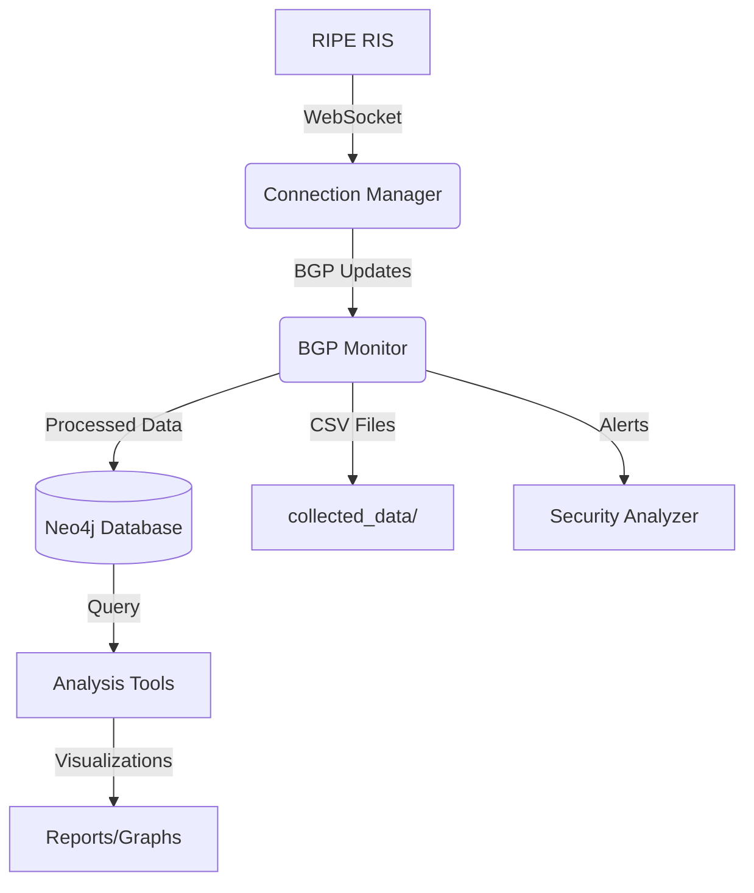

# BGP Monitor - Comprehensive Documentation

## Overview
The BGP Monitor is a tool for collecting, analyzing, and monitoring BGP routing updates in real-time. It connects to RIPE RIS (Routing Information Service) to receive live BGP updates, processes them, and stores them in both CSV files and a Neo4j graph database.

## Core Components

### Data Collection
- **bgp_collector.py**: Main collection script that:
  - Connects to RIPE RIS WebSocket API
  - Processes BGP updates (announcements & withdrawals)
  - Stores updates in CSV and Neo4j
  - Implements AS number filtering
  - Tracks AS path changes
  - Logs all activities

- **connection_manager.py**: Handles WebSocket connections:
  - Manages connection to RIPE RIS
  - Handles subscriptions to BGP updates
  - Processes incoming messages
  - Implements error handling and reconnection logic

### Data Storage
- **utils/db_manager.py**: Neo4j database operations:
  - Stores BGP updates with relationships
  - Tracks suspicious updates
  - Manages AS and prefix relationships
  - Provides query capabilities

### Security Analysis
- **utils/security_analyzer.py**: Detects suspicious patterns:
  - BGP hijacking attempts (prefix overlap checks)
  - AS path manipulation
  - Unusual transit provider positions
  - Frequent path changes
  - Origin AS changes
  - Long AS paths
  - Logs and stores suspicious updates

### Data Analysis
- **utils/analysis.py**: Provides analysis and visualization:
  - Statistical analysis of BGP updates
  - Time-based analysis
  - Visualization of update types and AS paths
  - AS relationship graphing
  - Report generation
  - Data filtering and export

## Configuration

### Database Configuration
- **config/database_config.py**: Contains:
  - Neo4j connection URI
  - Authentication credentials
  - Connection settings

### Collector Configuration
- **config/collectors.py**: Defines:
  - Available RIPE RIS collectors
  - Geographic locations
  - Default collector settings

## Usage

### Starting the Monitor
```bash
python main.py
```

### Command Line Options
- `--collector`: Specify collector ID (default: all)
- `--filter-as`: Comma-separated list of AS numbers to monitor
- `--log-level`: Set logging level (DEBUG, INFO, WARNING, ERROR)

### Example: Monitor Specific AS
```bash
python main.py --filter-as 15169,32934
```

## Security Monitoring
The tool automatically checks for:
- Prefix hijacking attempts
- AS path manipulation
- Unusual routing patterns
- Frequent path changes

Suspicious updates are:
1. Logged with details
2. Stored in Neo4j with alert reasons
3. Printed to console with 🚨 emoji

## Data Analysis Examples

### Generate Statistics Report
```python
from utils.analysis import BGPAnalyzer
analyzer = BGPAnalyzer()
df = analyzer.load_data("collected_data/updates.csv")
results = analyzer.analyze_updates(df)
analyzer.generate_report(results, "report.html")
```

### Visualize AS Relationships
```python
fig = analyzer.plot_as_relationships(df, save_path="as_graph.html")
```

## Architecture Overview



## File Structure
- `collected_data/`: CSV files with BGP updates
- `config/`: Configuration files
- `gui/`: Graphical user interface components
- `logs/`: Application log files
- `src/`: Core application code
- `tests/`: Test scripts
- `utils/`: Utility functions and analysis tools

## Testing
Run test scripts to verify functionality:
```bash
python tests/test_neo4j_connection.py
python tests/validate_neo4j_data.py
python tests/test_security_analyzer.py
```

## Troubleshooting
1. Check `bgp_monitor.log` for errors
2. Verify Neo4j connection in `config/database_config.py`
3. Ensure RIPE RIS WebSocket is accessible
4. Check collector availability in `config/collectors.py`
