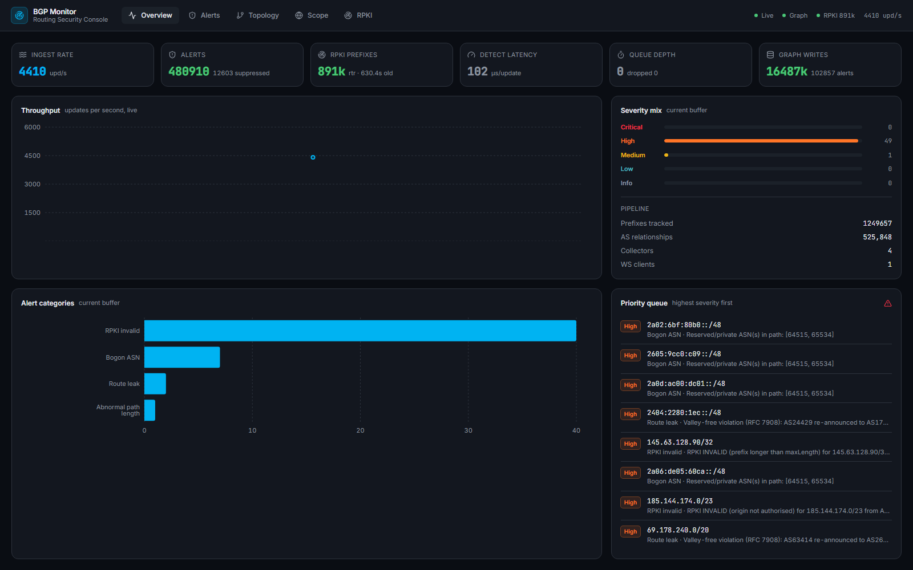
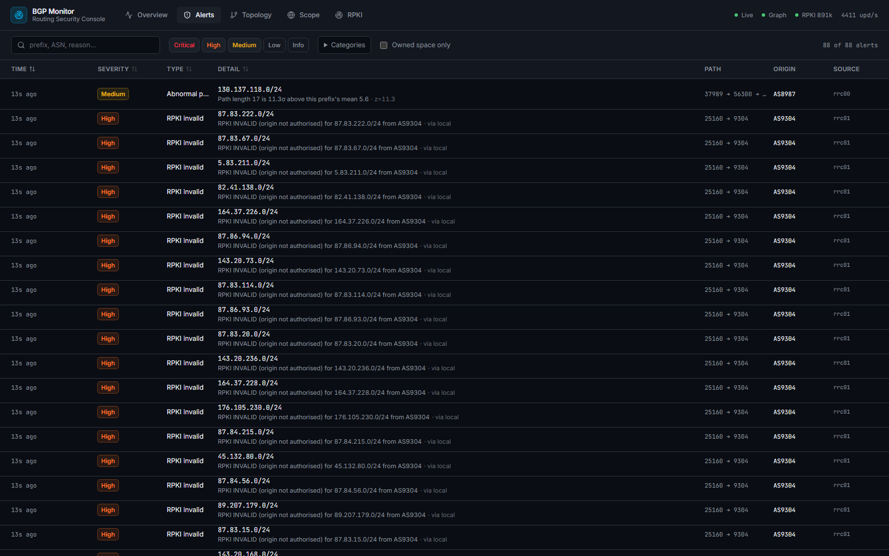
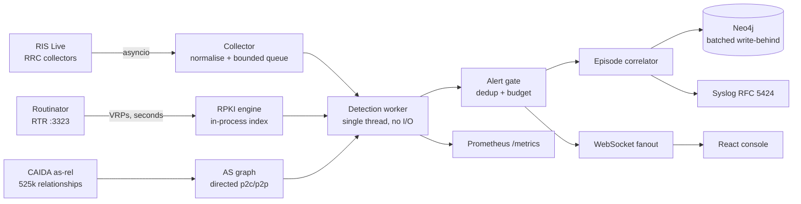

# BGP Monitor

Streaming BGP routing security monitoring. Ingests live RIPE RIS Live updates,
validates every announcement against the local RPKI set and a real AS
relationship graph, and surfaces only what is worth a NOC's attention.

Web-only. No API key is needed to run it — RIS Live, Routinator and CAIDA are all
public.



## What it does

- **Ingests live BGP updates** from RIPE RIS Live over WebSocket, across four RRC
  collectors, with explicit subscription acknowledgement and a bounded queue.
- **Validates every prefix** against a locally indexed RPKI VRP set synced over
  RTR — cryptographically derived, not a heuristic.
- **Detects route leaks** by RFC 7908 valley-free checking against CAIDA's
  directed AS relationship graph (525 848 edges).
- **Correlates alerts into incidents**, so one hijack or one leaky pair is one
  episode rather than a thousand alerts.
- **Streams to a React console** over WebSocket, served by the same process, and
  exposes Prometheus metrics and a JSON API.
- **Forwards to a SIEM** over syslog RFC 5424, so the SIEM stays the system of
  record.

## Measured on live traffic

Four collectors, Neo4j 5.26, sustained:

| | |
|---|---|
| Ingest | **4 430 updates/s**, 19 252 402 updates, **0 dropped** |
| Detection | **102 µs** mean per update, single-threaded |
| RPKI | **891 033 prefixes** indexed, synced over RTR |
| Routing table observed | 1 253 530 prefixes tracked |
| Graph writes | 17 194 310 updates + 102 857 alerts, **0 failed batches** |
| Leak detection | RFC 7908 over 525 848 AS relationships |

The dashboard above is a real capture from this stack, not a mockup. Throughput
history builds while the page stays open.



## Detection

Every detector is baselined, so "unexpected" is distinguishable from "merely new":

| Kind | Baseline | Severity |
|---|---|---|
| `HIJACK_ORIGIN` | owned prefix + authorised/RPKI-valid origins | CRITICAL |
| `HIJACK_SUB_PREFIX` | more-specific of owned/critical space, RPKI-valid splits exempt | HIGH |
| `RPKI_INVALID` | local VRP set, RFC 6811 | CRITICAL if owned, else HIGH |
| `ROUTE_LEAK` | RFC 7908 valley-free on the directed CAIDA graph | HIGH |
| `BOGON_ASN` / `BOGON_PREFIX` | reserved ASN ranges and RFC 6890 space | HIGH |
| `VISIBILITY_LOSS` | owned prefix absent past grace across ≥2 collectors | CRITICAL |
| `NEW_PREFIX` | monitored AS announcing unseen space | MEDIUM |
| `LONG_PATH` | per-prefix path-length distribution, z-score | MEDIUM |
| `PREPEND` | watched/owned origins only | LOW |

Alert volume is controlled by construction rather than by blanket suppression:
leaks are keyed by offending AS pair (one incident ≠ 1 000 alerts), anomalous
paths by origin+length, and the gate applies per-key rate limits plus a global
budget. Two unknown-edge conservatisms are deliberate: a path containing an AS
whose relationship is absent from CAIDA is **not judged**, and a first sighting of
a new origin is held for corroboration before it pages.

Full semantics, including what each severity means and why:
[Logic.md](Logic.md).

## Features

### Ingest
- Async RIS Live client, RRC-only (Route Views ids are rejected at config load)
- Explicit `ris_subscribe` acknowledgement, with the first real update kept if it
  races the ack
- Bounded queue with drop accounting, reconnect backoff, stale-session detection

### RPKI
- RTR client against Routinator; ~890k prefixes indexed in-process in seconds
- Local VRP set decides every verdict; RIPEstat consulted only when the local set
  cannot answer at all
- `NOT_FOUND` reported honestly — absence of a ROA is not a routing fault

### Leaks
- RFC 7908 valley-free evaluation in propagation order
- Directed p2c/p2p graph, so reversing a path yields the correct relationship
- Unknown hops silence the check rather than manufacturing suspicion

### Incidents
- Alerts grouped into episodes by `(prefix, origin)` within a time window
- Severity-weighted scoring, RPKI and critical-prefix multipliers
- Widest AS-path change per episode, as an explainable disturbance measure
- `GET /api/episodes`; session-scoped, so a restart mid-incident starts a new one

### Console
React 19 + Vite + Tailwind v4, served from the same FastAPI process.

- **Overview** — ingest rate, alert mix, RPKI health, latency, queue depth, priority queue
- **Alerts** — virtualised table, severity/kind/text filters, sortable, live via WebSocket
- **Scope** — ASN or operator-name lookup with live RPKI state per prefix
- **RPKI** — on-demand validation against the local VRP set

A global AS topology map was removed: it drew 400 origins with no pan, zoom or
drill-down, which was not a usable picture. Ad-hoc graph exploration lives in the
Neo4j browser at `http://localhost:7474`. A selection-driven neighbourhood view
is planned — see the roadmap.

### Operations
- Prometheus `/metrics`, `/api/health`, structured feed/sink/gate counters
- Syslog RFC 5424 sink, vendor-neutral and TCP
- Secrets from the environment only; the published port binds loopback

## Architecture



## Getting started

**Full guide: [INSTALL.md](INSTALL.md)** — prerequisites, container and native
routes, Windows/Podman, verification, and troubleshooting.

The short version:

```bash
# 1. Fetch the CAIDA AS relationship graph (1.6 MB). Not in git.
mkdir -p data
curl -o data/as_relationships.txt.bz2 \
  https://publicdata.caida.org/datasets/as-relationships/serial-1/20261001.as-rel.txt.bz2

# 2. Configure
cp .env.example .env          # set NEO4J_PASSWORD; set BGPMON_API_PORT if 8080 is taken

# 3. Validate, build, start
docker compose config --quiet
docker compose up -d --build

# 4. Confirm it is ingesting, not just running
curl -s http://localhost:8080/api/health
```

## Configuration

Secrets come from the environment — `.env` for compose, your shell for a native
run. `.env` is git-ignored.

| Variable | Purpose |
|---|---|
| `BGPMON_OWNED_PREFIXES` | your originated space; drives hijack and visibility alerts |
| `BGPMON_COLLECTORS` | RRC ids only |
| `BGPMON_NEO4J_URI` / `_USER` / `_PASSWORD` | graph sink |
| `BGPMON_RPKI_RTR_HOST` / `_PORT` | Routinator RTR endpoint |
| `BGPMON_API_TOKEN` | optional bearer auth for API and WebSocket |
| `BGPMON_VISIBILITY_GRACE` | seconds before an unseen owned prefix is a `VISIBILITY_LOSS` |

**Every variable, with defaults and what it silently degrades:**
[INSTALL.md](INSTALL.md#configuration-reference).

Two defaults worth knowing:

- **Owned prefixes are empty**, so hijack and visibility classification are
  dormant by design — a detector with no authorised set is a false-positive
  machine. RPKI, leaks and bogons still fire.
- **`BGPMON_API_TOKEN` is API-only.** The server enforces it on every `/api/*`
  route and on the WebSocket; the bundled console sends it only when
  `VITE_API_TOKEN` is set at build time.

## API

| Method | Path | Purpose |
|---|---|---|
| `GET` | `/api/health` | pipeline, RPKI, sink, gate and episode state |
| `GET` | `/api/alerts` | alert history, filterable by severity, kind and source |
| `GET` | `/api/episodes` | open incidents, ranked by score |
| `GET` | `/api/prefix/{prefix}/history` | announcements seen for a prefix |
| `GET` | `/api/topology` | observed AS adjacency |
| `GET` | `/api/scope/search` | ASN or operator lookup with RPKI state |
| `GET` | `/api/rpki/{prefix}/{origin}` | on-demand validation with matched and offending VRPs |
| `GET` | `/api/config` | effective configuration |
| `GET` | `/metrics` | Prometheus exposition |
| `WS` | `/ws/alerts` | live alert stream with a snapshot on connect |

All routes except `/api/health` and `/metrics` require the bearer token when one
is configured.

## Development

```bash
python -m pytest tests/ -v        # 141 tests
cd web && npm ci && npm run build # console
python -m bgpmon --soak 120       # headless throughput report
```

Each test pins a defect observed in live output: AS-relationship direction,
valley-free semantics, alert-per-incident scoping, id consistency, RTR parsing,
collector validation, bogon classification, visibility-loss detection, SPA deep
links, incident correlation, scope matching, and secret handling.

## Roadmap

**[ROADMAP.md](ROADMAP.md)** carries the full tracker. The items that matter most:

| | Item | Why |
|---|---|---|
| 1 | **Scope filter** — declare your ASNs, see only your alerts | On an unscoped install, 1 723 alerts in the recent window contained **two** concerning one operator's ASN. The library is built and tested; the API and console surface are what remain |
| 2 | **SIEM forwarding** — syslog RFC 5424 over TCP | The sink contract and gating are specced; not yet wired |
| 3 | **Seasonal `LONG_PATH` baseline** | Currently z-scores a 256-sample in-memory deque that resets on restart and models no seasonality, while path length is strongly diurnal |
| 4 | **Contextual topology** | Rebuild the removed global AS map as a selection-driven neighbourhood: pick an AS from an alert or an episode, see 1–2 hops with relationship type, prefix count and open-alert count. A global 400-node view has no useful picture; a local one answers "who is this AS and what does it touch" |
| 5 | **Enterprise deployment** | Reverse proxy for TLS, login screen, authorisation and audit with real identity. The app stays loopback-bound; the proxy terminates TLS |
| 6 | **ROA change detection**, ASPA, RFC 9234 peer-lock | Engine features, tracked |

## Security

- The published port binds **loopback**. For remote access, put a
  TLS-terminating reverse proxy in front of it rather than widening the bind.
  `docker port` reports `0.0.0.0` regardless of what the host listens on; treat
  that output as no evidence either way.
- All secrets come from the environment. Nothing sensitive is baked into an image
  or committed.
- Detection trusts only the RPKI VRP set to mark an origin authorised. Registry
  and IRR data inform scope — what you look at — and never what is a violation.

## Licence

See [LICENSE](LICENSE).