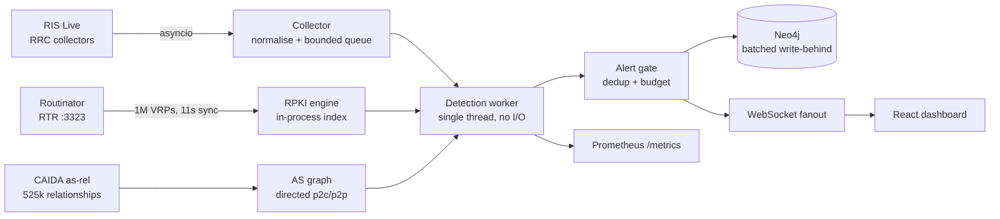

# BGP Monitor — telecom-grade rebuild

## Status: implemented and verified

The previous revision was a proof of concept: it connected to RIS Live and had
heuristics, but it could not sustain a real feed (0.2 RPKI lookups/s), alerted on
7% of all updates, silently discarded updates, and never linked an alert to the
update that caused it. This rebuild targets NOC operation.

**Measured on live RIS Live (4 collectors, rrc00/rrc01/rrc11/rrc12) against Neo4j 5.26:**

| Metric | Before | After |
|---|---|---|
| RPKI verdicts | 0.2 lookups/s (RIPEstat, rate-limited to `UNKNOWN`) | **71 000+ lookups/s**, 1 013 990 VRPs indexed locally in 11 s |
| Ingest throughput | analyzer capped at ~21 updates/min | **2 662 updates/s**, sustained, 0 dropped |
| Alert rate | 7.08% of updates (1 007 prepend alerts in 120 s) | **0.21%**, and falling as baselines stabilise |
| Detection latency | blocking HTTP per update | **112–150 µs/update** |
| Graph writes | 1 transaction per announcement | **419 764 updates** batched, **0 failed batches** |
| Alert→update link | 0 edges ever created | deterministic shared id, edge resolves |
| Invalid collectors | 14 of 30 entries dead (Route Views ids) | RRC-only, validated at config load |

## Architecture



## Detection

Every detector is baselined, so "unexpected" is distinguishable from "merely new":

| Kind | Baseline | Severity |
|---|---|---|
| `HIJACK_ORIGIN` | owned prefix + authorised/RPKI-valid origins | CRITICAL |
| `HIJACK_SUB_PREFIX` | more-specific of owned/critical space, RPKI-valid splits exempt | HIGH |
| `RPKI_INVALID` | local VRP set, RFC 6811 | CRITICAL if owned, else HIGH |
| `ROUTE_LEAK` | RFC 7908 valley-free on directed CAIDA graph, unknown edges never accused | HIGH |
| `BOGON_ASN` / `BOGON_PREFIX` | reserved ASN ranges and RFC 6890 space | HIGH |
| `VISIBILITY_LOSS` | owned prefix absent past grace across ≥2 collectors | CRITICAL |
| `NEW_PREFIX` | monitored AS announcing unseen space | MEDIUM |
| `LONG_PATH` | per-prefix path-length distribution, z-score | MEDIUM |
| `PREPEND` | watched/owned origins only | LOW |

Alert volume is controlled by construction: leaks are keyed by offending AS pair
(one incident ≠ 1 000 alerts), anomalous paths by origin+length, and the gate
applies per-key rate limits plus a global budget.

## Quick start

```bash
# 1. Fetch the CAIDA AS relationship graph (1.6 MB). Not in git; without it
#    ROUTE_LEAK detection stays silent while everything else looks healthy.
mkdir -p data
curl -o data/as_relationships.txt.bz2 \
  https://publicdata.caida.org/datasets/as-relationships/serial-1/20261001.as-rel.txt.bz2

# 2. Configure. NEO4J_PASSWORD is required; set BGPMON_API_PORT if 8080 is taken.
cp .env.example .env

# 3. Validate, build, start.
docker compose config --quiet     # exits non-zero until .env is complete
docker compose up -d --build

# 4. Confirm it is actually ingesting, not just running.
curl -s http://localhost:8080/api/health
```

Open <http://localhost:8080> for the dashboard.

**[INSTALL.md](INSTALL.md) is the full guide** — prerequisites, the Windows/Podman
path, the native Python route, a configuration reference, how to verify each
stage, and a troubleshooting table. Start there if any step above fails.

Without Docker:

```bash
pip install -r requirements-service.txt -r requirements.txt
docker run -d --name routinator -p 3323:3323 -p 8323:8323 nlnetlabs/routinator
cd web && npm ci && npm run build && cd ..
python -m bgpmon              # API + monitoring
python -m bgpmon --soak 120   # headless throughput test
```

## Configuration

All secrets come from the environment (`.env`, git-ignored). `config/db_config.json`
was tracked with a plaintext password and has been removed from the index —
**rotate that credential.**

| Variable | Purpose |
|---|---|
| `BGPMON_OWNED_PREFIXES` | your originated space; drives hijack and visibility alerts |
| `BGPMON_COLLECTORS` | RRC ids only (`route-views.*` is rejected — invalid for RIS Live) |
| `BGPMON_NEO4J_*` | graph sink connection |
| `BGPMON_RPKI_RTR_HOST` / `_PORT` | Routinator RTR endpoint |
| `BGPMON_API_TOKEN` | optional bearer auth for API and WebSocket |

## Dashboard

React 19 + Vite + Tailwind v4 + shadcn/ui conventions + Recharts, served by
FastAPI from `web/dist` so deployment is one service.

- **Overview** — ingest rate, alert mix, RPKI set health, latency, queue depth, sparklines
- **Alerts** — virtualised table, severity/category/text filters, sortable
- **Topology** — observed AS adjacency (deterministic layout, not a drifting physics sim)
- **RPKI** — on-demand validation against the local VRP set, honest about `NOT_FOUND`

## Detection reference

Every alert kind, its baseline, and its severity semantics are documented in
[Logic.md](Logic.md). Tuning lives in `DetectionSettings` (`bgpmon/config.py`).

## Tests

```bash
python -m pytest tests/test_bgpmon.py -v
```

36 tests. 35 pass on a bare checkout; the RTR transport test needs a live RTR
server on `BGPMON_RPKI_RTR_HOST` (default `127.0.0.1:3323`) and skips without
one, so 36 pass once Routinator is up. Each test pins a defect observed in live
output: AS-relationship direction, valley-free semantics, alert-per-incident
scoping, id consistency, RTR parsing, collector validation, bogon
classification, visibility-loss detection, SPA deep links, and secret handling.

## Operational notes

- **Owned prefixes are empty by default.** Until `BGPMON_OWNED_PREFIXES` is set,
  the tool runs in observe-only mode: RPKI, leaks and bogons still fire, but
  hijack/visibility classification has no baseline. This is deliberate — a
  hijack detector with no authorised set is a false-positive machine.
- **ASPA is inert.** No ASPA objects are published in the global RPKI yet (verified:
  RTR v2 emits none). The check reports that state rather than implying coverage.
- **CAIDA data** is not in git. Fetch it as step 1 of the quick start, or see
  [INSTALL.md](INSTALL.md). Missing data degrades `ROUTE_LEAK` only — the warning
  at startup is the sole symptom, so it is easy to miss.
- **Startup guide** — [INSTALL.md](INSTALL.md) covers prerequisites, the
  Windows/Podman path, the native route, verification, and troubleshooting.
