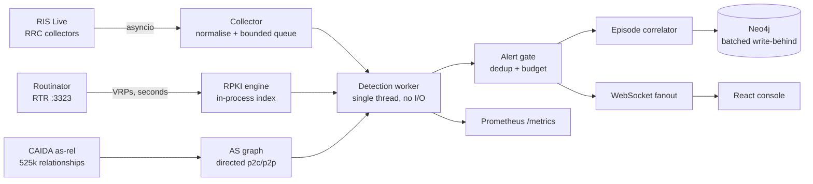

# BGP Monitor

Streaming BGP routing security monitoring. Ingests live RIPE RIS Live updates,
validates every announcement against a locally indexed RPKI set and a real AS
relationship graph, correlates related alerts into incidents, and streams the
result to a console.


Runs on public data — RIS Live, Routinator and CAIDA are all open. No API key.

## What it does

- **Ingests live BGP updates** from RIPE RIS Live over WebSocket across four RRC
  collectors, with explicit subscription acknowledgement and a bounded queue.
- **Validates every announcement** against an RPKI VRP set indexed in-process and
  synced over RTR — cryptographically derived, not heuristic.
- **Detects route leaks** by RFC 7908 valley-free checking against CAIDA's
  directed AS relationship graph (525 848 edges).
- **Correlates alerts into incidents**, so one hijack or one leaky AS pair is one
  episode rather than a thousand alerts.
- **Streams to a console** over WebSocket, served by the same process, alongside a
  JSON API and Prometheus metrics.

## Measured

Four collectors, Neo4j 5.26, sustained:

| | |
|---|---|
| Ingest | **5 985 updates/s**, **0 dropped** |
| Detection | **97 µs** mean per update, single-threaded |
| RPKI | **891 033 prefixes** indexed, synced over RTR |
| Routing table observed | 870 568 prefixes tracked |
| Graph writes | **797 000 updates + 401 alerts**, 0 failed batches |
| Leak detection | RFC 7908 over 525 848 AS relationships |

Screenshots are captures from a running stack. Throughput history builds while
the page stays open.


## Detection

Every detector is baselined, so "unexpected" is distinguishable from "merely new":

| Kind | Baseline | Severity |
|---|---|---|
| `HIJACK_ORIGIN` | owned prefix + authorised/RPKI-valid origins | CRITICAL |
| `HIJACK_SUB_PREFIX` | more-specific of owned/critical space, RPKI-valid splits exempt | HIGH |
| `RPKI_INVALID` | local VRP set, RFC 6811 | CRITICAL if owned, else HIGH |
| `ROUTE_LEAK` | RFC 7908 valley-free on the directed CAIDA graph | HIGH |
| `BOGON_ASN` / `BOGON_PREFIX` | reserved ASN ranges and RFC 6890 space | HIGH |
| `VISIBILITY_LOSS` | owned prefix absent past grace across ≥2 collectors | CRITICAL |
| `NEW_PREFIX` | monitored AS announcing unseen space | MEDIUM |
| `LONG_PATH` | per-prefix path-length distribution, z-score | MEDIUM |
| `PREPEND` | watched/owned origins only | LOW |

Volume is controlled by construction, not by blanket suppression: leaks are
keyed by offending AS pair, anomalous paths by origin and length, and the gate
applies per-key rate limits plus a global budget.

Two conservatisms are deliberate. A path containing an AS whose relationship is
absent from CAIDA is **not judged** — silence beats a guess. And a first sighting
of a new origin is held for corroboration before it pages.

Every rule, its baseline, and what each severity means: [Logic.md](Logic.md).

## Features

**Ingest** — Async RIS Live client, RRC-only (Route Views ids are rejected at
config load). Explicit `ris_subscribe` acknowledgement, keeping the first real
update if it races the ack. Bounded queue with drop accounting, reconnect
backoff, stale-session detection.

**RPKI** — RTR client against Routinator; ~890k prefixes indexed in-process in
seconds. The local set decides every verdict; RIPEstat is consulted only when the
local set cannot answer at all. `NOT_FOUND` is reported honestly — absence of a
ROA is not a routing fault.

**Leaks** — RFC 7908 valley-free evaluation in propagation order. Directed
p2c/p2p graph, so reversing a path yields the correct relationship. Unknown hops
silence the check rather than manufacturing suspicion.

**Incidents** — Alerts grouped by `(prefix, origin)` within a time window.
Severity-weighted scoring with RPKI and critical-prefix multipliers, and the
widest AS-path change seen per incident as an explainable disturbance measure.
`GET /api/episodes`. Session-scoped, so a restart mid-incident starts a new one.

**Console** — React 19 + Vite + Tailwind v4, served from the same FastAPI process.

- **Overview** — ingest rate, alert mix, RPKI health, latency, queue depth, priority queue
- **Alerts** — virtualised table, severity/kind/text filters, sortable, live
- **Scope** — ASN or operator-name lookup with live RPKI state per prefix
- **RPKI** — on-demand validation against the local VRP set

For ad-hoc graph exploration, the Neo4j browser is published on `127.0.0.1:7474`.

**Operations** — Prometheus `/metrics`, `/api/health`, structured feed, sink and
gate counters. Secrets from the environment only. The published port binds
loopback.

## Architecture



## Getting started

Full guide: **[INSTALL.md](INSTALL.md)** — prerequisites, container and native
routes, Windows and Podman, verification, troubleshooting.

```bash
# 1. Fetch the CAIDA AS relationship graph (1.6 MB). Not in git.
mkdir -p data
curl -o data/as_relationships.txt.bz2 \
  https://publicdata.caida.org/datasets/as-relationships/serial-1/20261001.as-rel.txt.bz2

# 2. Configure
cp .env.example .env

# 3. Validate, then build and start
docker compose config --quiet
docker compose up -d --build
```

The console is served on the host port set by `BGPMON_API_PORT` in `.env` —
`8080` by default:

```bash
curl -s http://localhost:8080/api/health
```

**If 8080 does not respond**, it is very likely already taken: on Windows a
system service commonly holds it. Pick another port and use it consistently:

```bash
# .env
BGPMON_API_PORT=8090
```

```bash
curl -s http://localhost:8090/api/health
```

`docker compose config` validates `.env` without starting anything, which is the
fastest way to confirm which port you configured.

## Configuration

Secrets come from the environment — `.env` under compose, your shell for a
native run. `.env` is git-ignored.

| Variable | Purpose |
|---|---|
| `BGPMON_OWNED_PREFIXES` | your originated space; drives hijack and visibility alerts |
| `BGPMON_COLLECTORS` | RRC ids only |
| `BGPMON_API_PORT` | host port under compose |
| `BGPMON_NEO4J_URI` / `_USER` / `_PASSWORD` | graph sink |
| `BGPMON_RPKI_RTR_HOST` / `_PORT` | Routinator RTR endpoint |
| `BGPMON_API_TOKEN` | optional bearer auth for the API and WebSocket |
| `BGPMON_VISIBILITY_GRACE` | seconds before an unseen owned prefix is a `VISIBILITY_LOSS` |

Every variable, with defaults and what each one degrades:
[INSTALL.md](INSTALL.md#configuration-reference).

Two defaults worth knowing:

- **Owned prefixes are empty**, so hijack and visibility classification are
  dormant — a detector with no authorised set is a false-positive machine. RPKI,
  leaks and bogons still fire.
- **`BGPMON_API_TOKEN` is API-only.** The server enforces it on every `/api/*`
  route and on the WebSocket; the console sends it only when `VITE_API_TOKEN` is
  set at build time.

## API

| Method | Path | Purpose |
|---|---|---|
| `GET` | `/api/health` | pipeline, RPKI, sink, gate and episode state |
| `GET` | `/api/alerts` | alert history, filterable by severity, kind and source |
| `GET` | `/api/episodes` | open incidents, ranked by score |
| `GET` | `/api/prefix/{prefix}/history` | announcements seen for a prefix |
| `GET` | `/api/topology` | observed AS adjacency |
| `GET` | `/api/scope/search` | ASN or operator lookup with RPKI state |
| `GET` | `/api/rpki/{prefix}/{origin}` | on-demand validation, with matched and offending VRPs |
| `GET` | `/api/config` | effective configuration |
| `GET` | `/metrics` | Prometheus exposition |
| `WS` | `/ws/alerts` | live alert stream, with a snapshot on connect |

All routes except `/api/health` and `/metrics` require the bearer token when one
is configured. Interactive docs are at `/docs`.

## Development

```bash
python -m pytest tests/ -v         # 143 tests
cd web && npm ci && npm run build # console
python -m bgpmon --soak 120        # headless throughput report
```

Each test pins a defect observed in live output: AS-relationship direction,
valley-free semantics, alert-per-incident scoping, id consistency, RTR parsing,
collector validation, bogon classification, visibility-loss detection, SPA deep
links, incident correlation, scope matching and secret handling.

## Roadmap

[ROADMAP.md](ROADMAP.md) has the full tracker. The items that matter most:

| | Item | Why |
|---|---|---|
| 1 | **Scope filter** | Declare your ASNs and see only your alerts. Across 1 723 alerts in a recent window, **two** concerned one operator's ASN. The matching and resolution libraries are built and tested; the API and console surface remain |
| 2 | **SIEM forwarding** | syslog RFC 5424 over TCP, vendor-neutral, gated on scope. Specced and not yet built — `BGPMON_SYSLOG_*` currently configures nothing |
| 3 | **Seasonal `LONG_PATH` baseline** | `LONG_PATH` z-scores a 256-sample in-memory deque that resets on restart and models no seasonality, while path length is strongly diurnal |
| 4 | **Contextual topology** | A selection-driven neighbourhood view: pick an AS from an alert or an incident, see one to two hops with relationship type, prefix count and open-alert count |
| 5 | **HTTPS and authentication** | Reverse proxy terminating TLS in front of the loopback bind, then a login screen, authorisation and audit with real identity |
| 6 | **ROA change detection**, ASPA, RFC 9234 peer-lock | Engine features |

## Security

- The published port binds **loopback**. For remote access, put a
  TLS-terminating reverse proxy in front of it rather than widening the bind.
  `docker port` reports `0.0.0.0` regardless of what the host actually listens
  on, so treat that output as no evidence either way.
- All secrets come from the environment. Nothing sensitive is baked into an image
  or committed.
- Detection trusts only the RPKI VRP set to mark an origin authorised. Registry
  and IRR data inform scope — what you look at — and never what counts as a
  violation.

## Licence

[LICENSE](LICENSE).